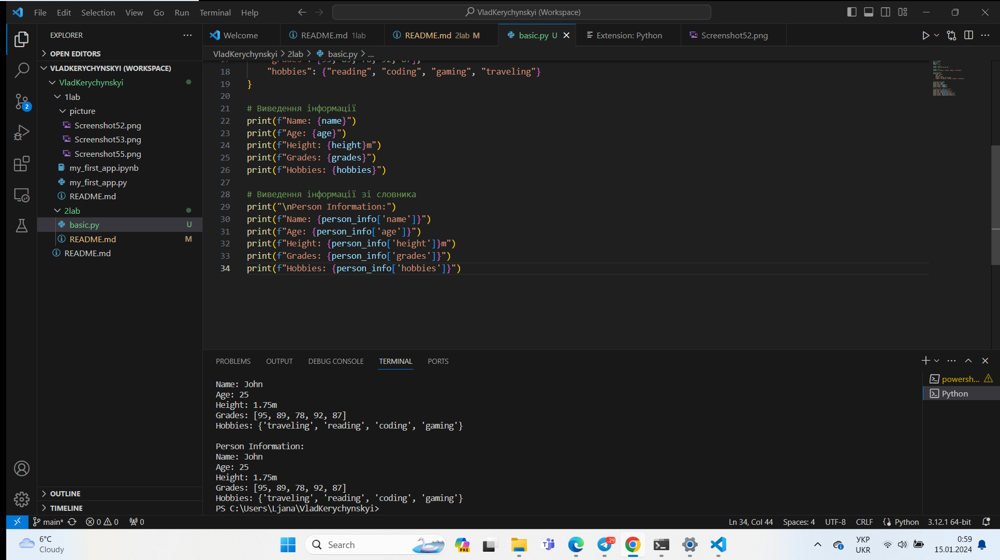
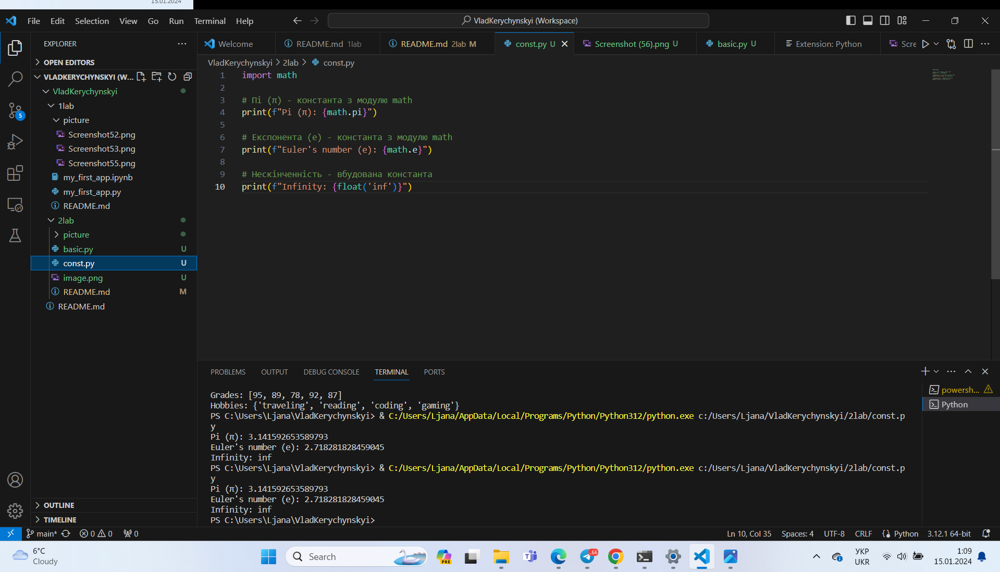
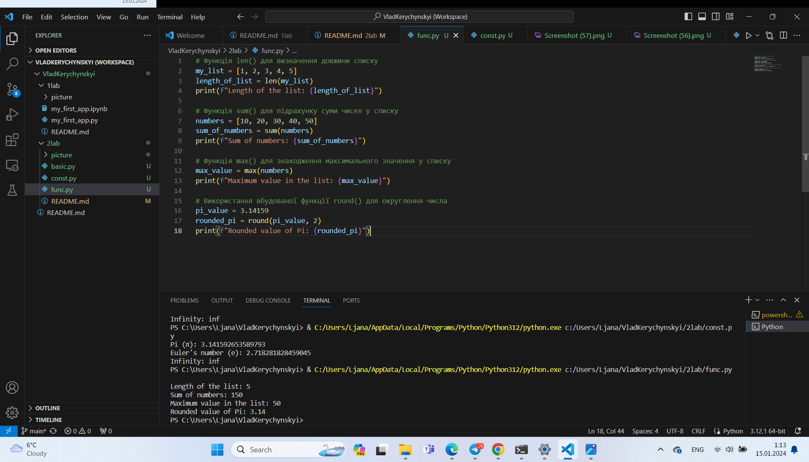
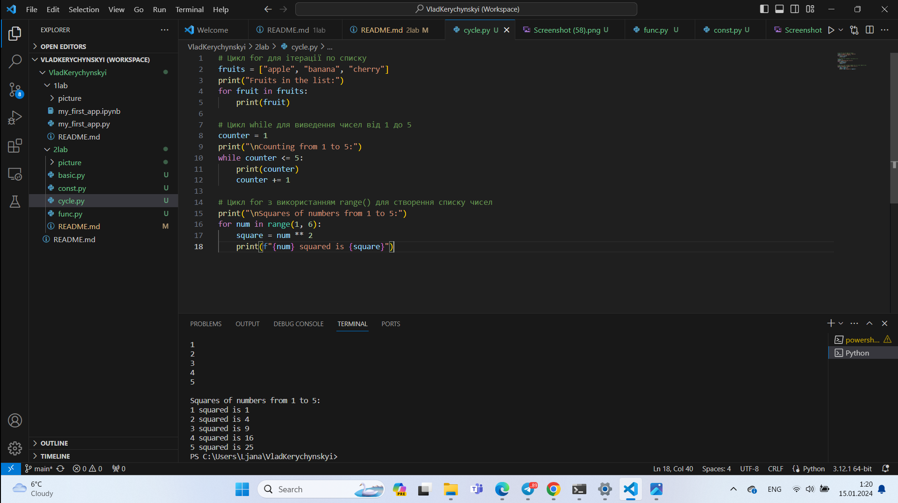
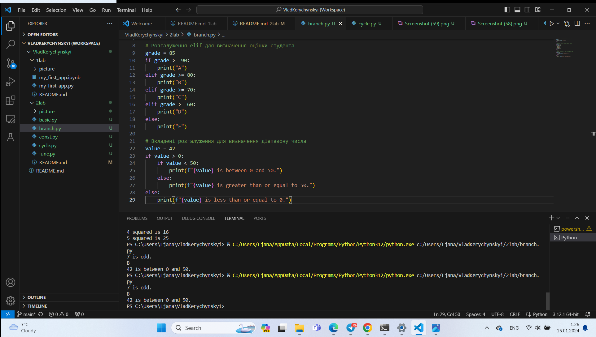
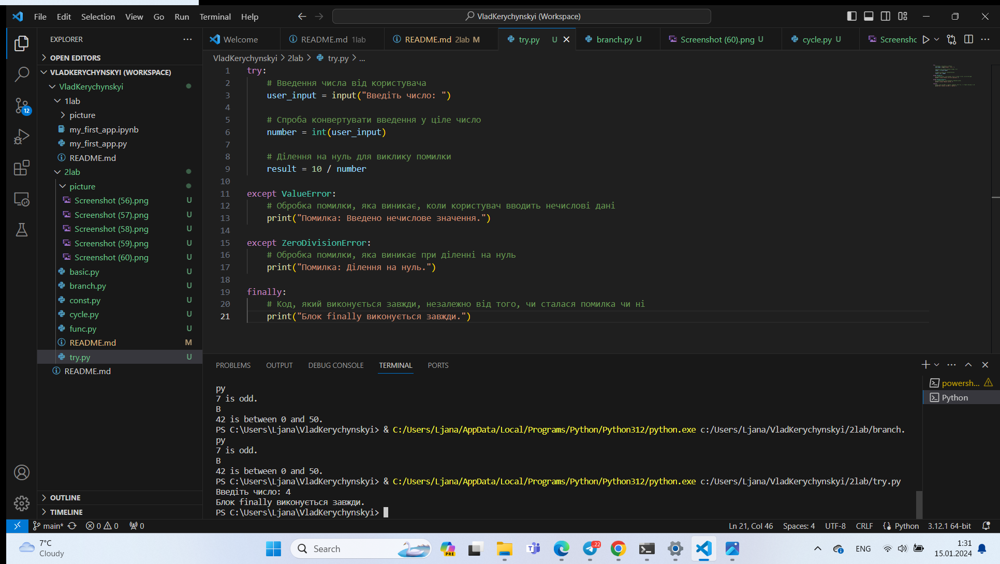
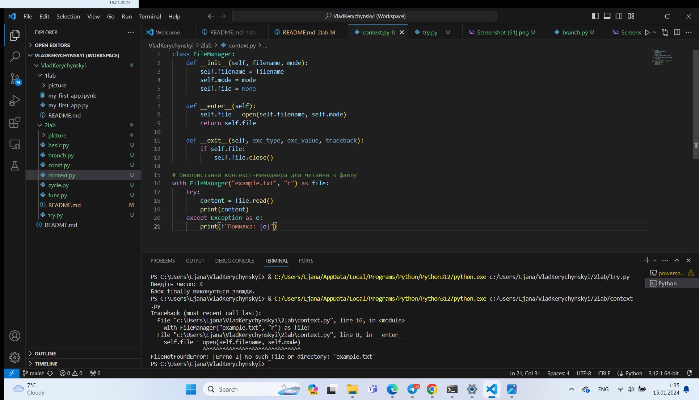
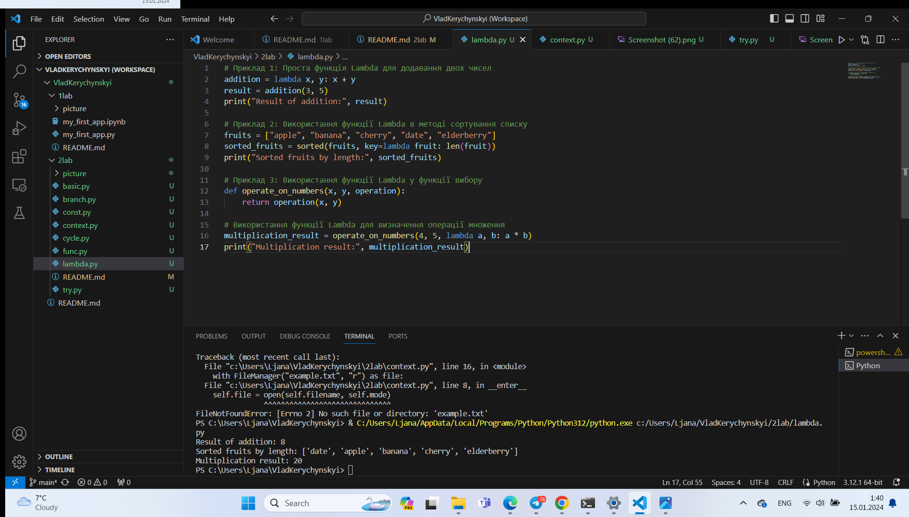

# Звіт до роботи
## Тема: _Основи програмування на Python_
### Мета роботи: _Навчитися основам програмування python_

---
### Виконання роботи
* Результати виконання завдання ;
   
    1. Приклад програми з простими змінними, списками list, наборами set та словниками dict
  ```python  
 name = "John"
 age = 25
 height = 1.75
 grades = [95, 89, 78, 92, 87]
 hobbies = {"reading", "coding", "gaming", "traveling"}
 person_info = {
    "name": "John",
    "age": 25,
    "height": 1.75,
    "grades": [95, 89, 78, 92, 87],
    "hobbies": {"reading", "coding", "gaming", "traveling"}
 }
 print(f"Name: {name}")
 print(f"Age: {age}")
 print(f"Height: {height}m")
 print(f"Grades: {grades}")
 print(f"Hobbies: {hobbies}")
 print("\nPerson Information:")
 print(f"Name: {person_info['name']}")
 print(f"Age: {person_info['age']}")
 print(f"Height: {person_info['height']}m")
 print(f"Grades: {person_info['grades']}")
 print(f"Hobbies: {person_info['hobbies']}")
```
Програма вивела

   
    1. Приклад програми виведення вбудованих констант
    import math

# Пі (π) - константа з модулю math
print(f"Pi (π): {math.pi}")

# Експонента (е) - константа з модулю math
print(f"Euler's number (e): {math.e}")

# Нескінченність - вбудована константа
print(f"Infinity: {float('inf')}")

Прогама вивела

    
    1. Створив програму виведення результату роботи вбудованих функцій 
    # Функція len() для визначення довжини списку
my_list = [1, 2, 3, 4, 5]
length_of_list = len(my_list)
print(f"Length of the list: {length_of_list}")

# Функція sum() для підрахунку суми чисел у списку
numbers = [10, 20, 30, 40, 50]
sum_of_numbers = sum(numbers)
print(f"Sum of numbers: {sum_of_numbers}")

# Функція max() для знаходження максимального значення у списку
max_value = max(numbers)
print(f"Maximum value in the list: {max_value}")

# Використання вбудованої функції round() для округлення числа
pi_value = 3.14159
rounded_pi = round(pi_value, 2)
print(f"Rounded value of Pi: {rounded_pi}")
Програма вивела



    1.  Написав код який демонструє роботу циклів
    # Цикл for для ітерації по списку
fruits = ["apple", "banana", "cherry"]
print("Fruits in the list:")
for fruit in fruits:
    print(fruit)

# Цикл while для виведення чисел від 1 до 5
counter = 1
print("\nCounting from 1 to 5:")
while counter <= 5:
    print(counter)
    counter += 1

# Цикл for з використанням range() для створення списку чисел
print("\nSquares of numbers from 1 to 5:")
for num in range(1, 6):
    square = num ** 2
    print(f"{num} squared is {square}")
    Програма вивела



1. Написав код який демонструє роботу розгалужень
# Розгалуження if-else для визначення парності числа
number = 7
if number % 2 == 0:
    print(f"{number} is even.")
else:
    print(f"{number} is odd.")

# Розгалуження elif для визначення оцінки студента
grade = 85
if grade >= 90:
    print("A")
elif grade >= 80:
    print("B")
elif grade >= 70:
    print("C")
elif grade >= 60:
    print("D")
else:
    print("F")

# Вкладені розгалуження для визначення діапазону числа
value = 42
if value > 0:
    if value < 50:
        print(f"{value} is between 0 and 50.")
    else:
        print(f"{value} is greater than or equal to 50.")
else:
    print(f"{value} is less than or equal to 0.")

програма вивела


1.Конструкція try->except->finally. Написав свій варіант коду з помилкою.
try:
    # Введення числа від користувача
    user_input = input("Введіть число: ")

    # Спроба конвертувати введення у ціле число
    number = int(user_input)

    # Ділення на нуль для виклику помилки
    result = 10 / number

except ValueError:
    # Обробка помилки, яка виникає, коли користувач вводить нечислові дані
    print("Помилка: Введено нечислове значення.")

except ZeroDivisionError:
    # Обробка помилки, яка виникає при діленні на нуль
    print("Помилка: Ділення на нуль.")

finally:
    # Код, який виконується завжди, незалежно від того, чи сталася помилка чи ні
    print("Блок finally виконується завжди.")
    Програма вивела


   
   1.Написав свій код з контекст-менеджером
   class FileManager:
    def __init__(self, filename, mode):
        self.filename = filename
        self.mode = mode
        self.file = None

    def __enter__(self):
        self.file = open(self.filename, self.mode)
        return self.file

    def __exit__(self, exc_type, exc_value, traceback):
        if self.file:
            self.file.close()

# Використання контекст-менеджера для читання з файлу
with FileManager("example.txt", "r") as file:
    try:
        content = file.read()
        print(content)
    except Exception as e:
        print(f"Помилка: {e}")
        
        Програма вивела
   
    
    1.  Написав свій приклад коду з lambdas
    # Приклад 1: Проста функція Lambda для додавання двох чисел
addition = lambda x, y: x + y
result = addition(3, 5)
print("Result of addition:", result)

# Приклад 2: Використання функції Lambda в методі сортування списку
fruits = ["apple", "banana", "cherry", "date", "elderberry"]
sorted_fruits = sorted(fruits, key=lambda fruit: len(fruit))
print("Sorted fruits by length:", sorted_fruits)

# Приклад 3: Використання функції Lambda у функції вибору
def operate_on_numbers(x, y, operation):
    return operation(x, y)

# Використання функції Lambda для визначення операції множення
multiplication_result = operate_on_numbers(4, 5, lambda a, b: a * b)
print("Multiplication result:", multiplication_result)
 Програма вивела
 


  
---
### Висновок:
 Навчився створювати програми з простими змінними, списками list, наборами set та словниками dict
 Навчився створювати програми виведення вбудованих констант import math
 Навчився створювати програму виведення результату роботи вбудованих функцій 
 Навчився писати код який демонструє роботу циклів   
 Навчився писати код який демонструє роботу розгалужень
 Вивчив конструкцію try->except->finally
 Написав свій код з контекст-менеджером
  Написав свій приклад коду з lambdas