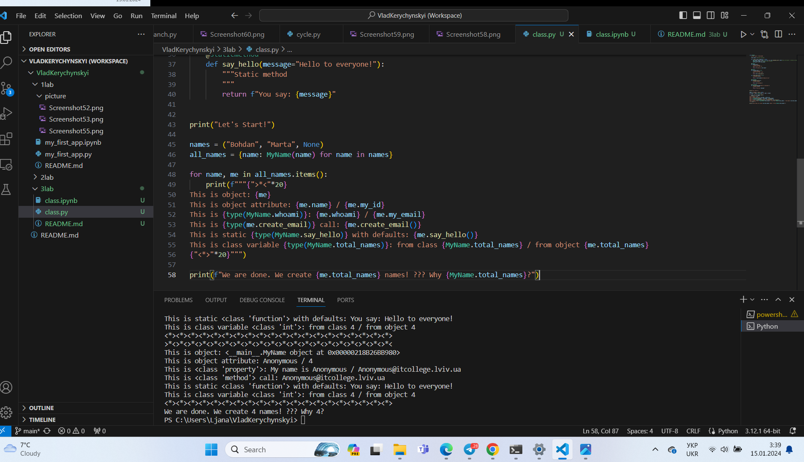
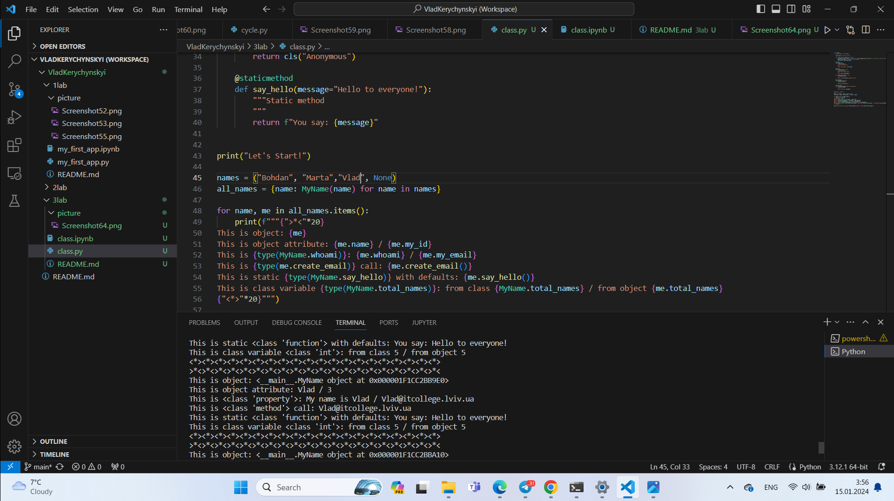
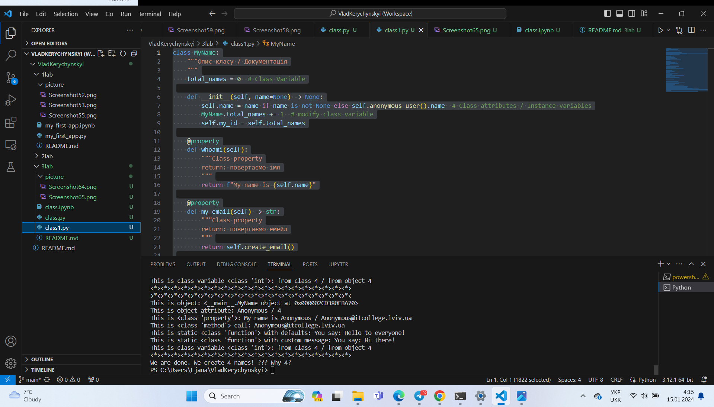
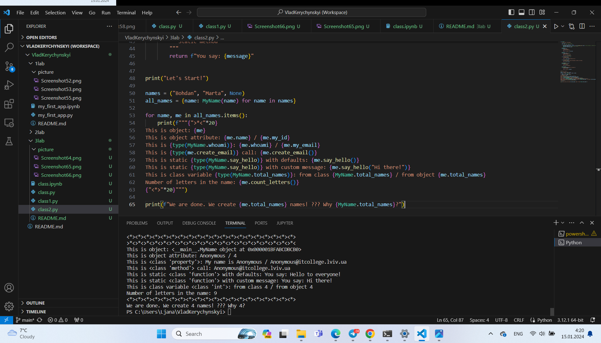

# Звіт до роботи
## Тема: _Знайомство з ООП_
### Мета роботи: _Ознайомитись з ООП_

---
### Виконання роботи
* Результати виконання завдання ;
    1. Створив два python файли: для Ноутбука з розширенням .ipynb та для скрипта з розширенням .py;
    1. Результат програми
    

    1. Модифікував програму додавши своє імя в список;
    
    Результат програми
    
   
    1. У конструкторі класу MyName використовується тернарний оператор для визначення значення атрибуту name. Якщо name передається як None, то викликається метод anonymous_user(), який створює новий об'єкт класу з ім'ям "Anonymous".
    1. Змінив текст привітання при виклику методу say_hello() 
      class MyName:
    """Опис класу / Документація
    """
    total_names = 0  # Class Variable

    def __init__(self, name=None) -> None:
        self.name = name if name is not None else self.anonymous_user().name  # Class attributes / Instance variables
        MyName.total_names += 1  # modify class variable
        self.my_id = self.total_names

    @property
    def whoami(self):
        """Class property
        return: повертаємо імя
        """
        return f"My name is {self.name}"

    @property
    def my_email(self) -> str:
        """Class property
        return: повертаємо емейл
        """
        return self.create_email()

    def create_email(self) -> str:
        """Instance method
        """
        return f"{self.name}@itcollege.lviv.ua"

    @classmethod
    def anonymous_user(cls):
        """Class method
        """
        return cls("Anonymous")

    @staticmethod
    def say_hello(message="Hello to everyone!"):
        """Static method
        """
        return f"You say: {message}"

print("Let's Start!")

names = ("Bohdan", "Marta", None)
all_names = {name: MyName(name) for name in names}

for name, me in all_names.items():
    print(f"""{">*<"*20}
This is object: {me}
This is object attribute: {me.name} / {me.my_id}
This is {type(MyName.whoami)}: {me.whoami} / {me.my_email}
This is {type(me.create_email)} call: {me.create_email()}
This is static {type(MyName.say_hello)} with defaults: {me.say_hello()}
This is static {type(MyName.say_hello)} with custom message: {me.say_hello("Hi there!")}
This is class variable {type(MyName.total_names)}: from class {MyName.total_names} / from object {me.total_names}
{"<*>"*20}""")

print(f"We are done. We create {me.total_names} names! ??? Why {MyName.total_names}?")
Програма вивела

* Дописав функцію в класі яка порахує кількість букв і імені 
class MyName:
    """Опис класу / Документація
    """
    total_names = 0  # Class Variable

    def __init__(self, name=None) -> None:
        self.name = name if name is not None else self.anonymous_user().name  # Class attributes / Instance variables
        MyName.total_names += 1  # modify class variable
        self.my_id = self.total_names

    @property
    def whoami(self):
        """Class property
        return: повертаємо імя
        """
        return f"My name is {self.name}"

    @property
    def my_email(self) -> str:
        """Class property
        return: повертаємо емейл
        """
        return self.create_email()

    def create_email(self) -> str:
        """Instance method
        """
        return f"{self.name}@itcollege.lviv.ua"

    def count_letters(self):
        """Instance method to count the number of letters in the name.
        """
        return len(self.name)

    @classmethod
    def anonymous_user(cls):
        """Class method
        """
        return cls("Anonymous")

    @staticmethod
    def say_hello(message="Hello to everyone!"):
        """Static method
        """
        return f"You say: {message}"

print("Let's Start!")

names = ("Bohdan", "Marta", None)
all_names = {name: MyName(name) for name in names}

for name, me in all_names.items():
    print(f"""{">*<"*20}
This is object: {me}
This is object attribute: {me.name} / {me.my_id}
This is {type(MyName.whoami)}: {me.whoami} / {me.my_email}
This is {type(me.create_email)} call: {me.create_email()}
This is static {type(MyName.say_hello)} with defaults: {me.say_hello()}
This is static {type(MyName.say_hello)} with custom message: {me.say_hello("Hi there!")}
This is class variable {type(MyName.total_names)}: from class {MyName.total_names} / from object {me.total_names}
Number of letters in the name: {me.count_letters()}
{"<*>"*20}""")

print(f"We are done. We create {me.total_names} names! ??? Why {MyName.total_names}?")
Програма вивела

1. Щодо питання про різну кількість імен у списку names та в об'єктах класу, це може виникнути через обчислення кількості створених об'єктів класу, а не кількості елементів у списку. Вибір імені "Anonymous" також може вплинути на різницю. Якщо ви хочете, щоб кількість об'єктів класу відповідала кількості імен у списку, ви можете змінити конструктор класу, щоб передавати ім'я за замовчуванням як "Anonymous" лише у випадку, коли значення name є None.

  
---
### Висновок:
 Навчився змінювати текст привітання при виклику методу say_hello()
Навчився писати функцію в класі яка порахує кількість букв і імені .